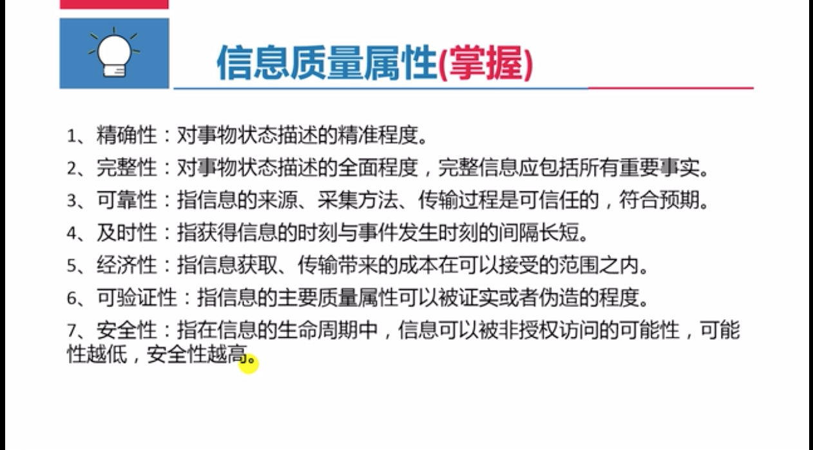
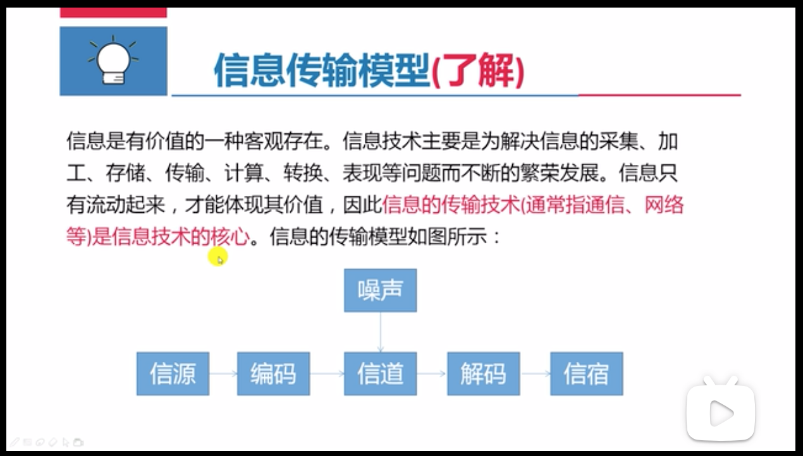
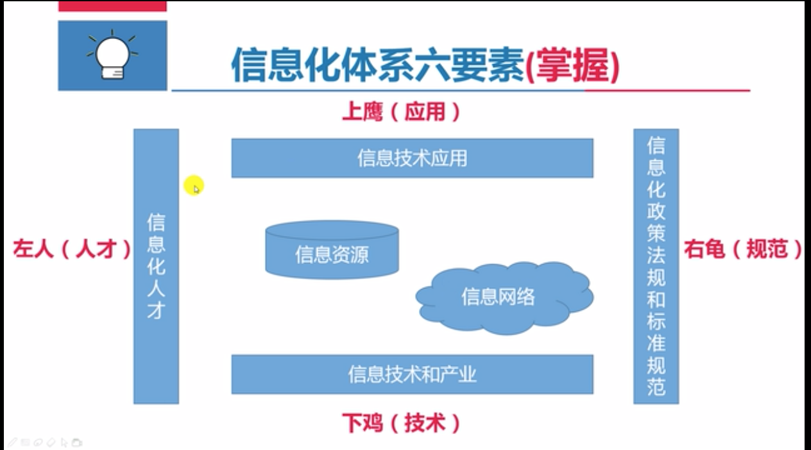

##野人老师
https://www.bilibili.com/video/BV1dJ41117Aa?p=2
https://appn27rhczr6822.pc.xiaoe-tech.com/index

#截图快捷键
Command+Shift+4（区域截图）

#PDF分割——免费在线拆分PDF文件成多个文件
https://www.ilovepdf.com/zh-cn/split_pdf

#目    录（from http://product.dangdang.com/25157446.html）
##第1章  信息化和信息系统 1
###1.1  信息系统与信息化 2
1.1.1  信息的基本概念 2

1.1.2  信息系统的基本概念 5
1.1.3  信息化的基本概念 7
信息化的五个层次

信息化的内涵：
主体、手段、途径、目标

了解：两网、一站、四库、十二金
信息化体系六要素
上鹰下鸡左人右龟

1.1.4  信息系统生命周期 10
信息系统生命周期
###1.2  信息系统开发方法 12
1.2.1  结构化方法 12
结构化方法
主要特点：开发目标清晰化、开发阶段工作化、开发文档规范化、设计方法结构化。
不足和局限性：开发周期化、难以适用需求变化、很少考虑数据结构。
1.2.2  面向对象方法 14
面向对象方法
原型化方法
水平原型、垂直原型
抛弃式原型、演化式原型
1.2.3  原型化方法 14
1.2.4  面向服务的方法 17
面向服务的方法
###1.3  常规信息系统集成技术 17
1.3.1  网络标准与网络协议 17
OSI七层模型
物理层、数据链路层（802.3/.2）、网络层(IP)、传输层(TCP)、会话层、表示层、应用层
802.11无线局域网WLAN标准协议
TCP/IP协议是Internet的核心。

应用层协议
FTP（传输控制21、传输文件20）
TFTP简单文件传输协议
HTTP
SMTP
DHCP
Telnet
DNS
SNMP

p20
传输层协议：TCP、UDP

p21
网络层协议
IP、ICMP、IGMP、ARP、RARP
1.3.2  网络设备 21
网络设备
路由器工作在网络层、交换机工作在所有层。
1.3.3  网络服务器 22
1.3.4  网络存储技术 23
网络存储技术
直接附加存储DAS、网络附加存储NAS、存储区域网络SAN
1.3.5  网络接入技术 26
网络接入技术
5G-1Gbps
1.3.6  网络规划与设计 28
网络规划与设计
核心层、汇聚层、接入层
1.3.7  数据库管理系统 30
Oracle、Mysql、SqlServer
MongoDB
1.3.8  数据仓库技术 31
1.3.9  中间件技术 33
三个层次
1.3.10  高可用性和高可靠性的规划与设计 34
可用性战术：
###1.4  软件工程 35
####1.4.1  需求分析 35
#####1.需求层次
1、业务需求
2、用户需求
3、系统需求：功能需求、非功能需求、设计约束

#####2.质量功能部署
常规需求
期望需求
意外需求
#####3.需求获取
#####4.需求分析
数据字典
-数据模型（E-R图）
-功能模型（数据流图）
-行为模型（状态转换图）
#####5.软件需求规格说明书（SRS）
应该包含的内容。
#####6.需求验证
验证手段：需求评审、需求测试
#####7.UML
四个关系：依赖、关联、泛化、实现
1.4.2  软件架构设计 44
1.4.3  软件设计 46
1.4.4  软件工程的过程管理 48
1.4.5  软件测试及其管理 49
1.4.6  软件集成技术 53
###1.5  新一代信息技术 56
1.5.1  物联网 57
1.5.2  云计算 59
1.5.3  大数据 62
1.5.4  移动互联 67
互联网+

###1.6  信息系统安全技术 68
1.6.1  信息安全的有关概念 68
四个层次：设备安全、数据安全、内容安全、行为安全。
信息安全等级保护

|   级别   |   受侵害的客体    |      对客体的侵害程度   |
|   :---  |     :---            |    :----   |
|  一级    |  公民、法人和其他组织 |  损害        |
|  二级    |  公民、法人和其他组织 |  严重损害    |
|  二级    |  社会秩序、公共利益   |  损害       |
|  三级    |  社会秩序、公共利益   |  严重损害    |
|  三级    |  国家安全            |  损害       |
|  四级    |  社会秩序、公共利益   |  特别严重损害 |
|  四级    |  国家安全            |  严重损害    |
|  五级    |  国家安全            |  特别严重损害 |

安全保护能力的五个级别（详细在p11）：户计全结访
1.6.2  信息加密、解密与常用算法 72
####1.6.3  信息系统安全 74
#####1、计算机设备安全
######1）物理安全
######2）设备安全
######3）存储介质安全
######4）可靠性技术
#####2、网络安全
######1）防火墙
######2）入侵检测与防护
######3）VPN
######4）安全扫描
######5）网络蜜罐技术
#####3、操作系统安全
#####4、数据库系统安全
#####5、应用系统安全
######WEB访问控制技术
#######1）Web访问控制技术：IP地址、子网或域名、用户名/口令、公钥加密体系PKI（CA认证）
#######2）单点登陆技术
#######3）网页防篡改技术：时间轮询、核心内嵌、事件触发、文件过滤驱动
#######4）Web内容安全：电子邮件过滤、网页过滤、反间谍软件
###1.7  信息化发展与应用 81
1.7.1  信息化发展与应用的新特点 81
十三五规划（2016-2020）
1.7.2  国家信息化发展战略 83
1.7.3  电子政务 91
1.7.4  电子商务 93
1.7.5  工业和信息化融合 96
1.7.6  智慧化 100
###1.8  信息系统服务管理 103
1.8.1  信息系统服务业及发展 103
1.8.2  信息系统工程监理的概念和发展 106
1.8.3  信息系统运行维护的概念和发展 108
1.8.4  信息技术服务管理的标准和框架 110
###1.9  信息系统规划 112
1.9.1  大型信息系统 113
1.9.2  信息系统的规划方法 114
1.9.3  信息系统的规划工具 117
###1.10  企业首席信息官及其职责 118

###1.11  本章练习 120
##第2章  信息系统项目管理基础 123
2.1  项目管理基础 123
2.1.1  项目的概念 123
2.1.2  项目的特点 123
项目的目标特性：多目标性、优先性、层次性
2.1.3  项目与日常运作的关系 125
2.1.4  项目和战略规划 126
2.1.5  信息系统项目的特点 127
2.1.6  项目管理定义 128
 
2.1.7  项目管理的特点 129
2.2  项目管理知识体系构成 131
2.2.1  项目管理知识体系 131
2.2.2  应用领域的知识、标准和规定 132
2.2.3  理解项目环境 132
2.2.4  一般的管理知识和技能 133
2.2.5  软技能 133
2.3  IPMP/PMP 133
2.3.1  IPMA和IPMP简介 133
2.3.2  PMI和PMP简介 135
2.4  PRINCE2 136
2.4.1  PRINCE2定义与结构 136
2.4.2  PRINCE2原则 137
2.4.3  PRINCE2主题 138
2.4.4  PRINCE2流程 138
2.4.5  PRINCE2环境 139
2.5  组织结构对项目的影响 139
2.5.1  组织体系 139
2.5.2  组织的文化与风格 140
2.5.3  组织结构 140

2.5.4  PMO在组织结构中的作用 143
2.6  信息系统项目的生命周期 144
2.6.1  项目生命周期基础 144
2.6.2  项目生命周期的特征 144
2.6.3  项目阶段 146
2.7  信息系统项目典型生命周期模型 147
2.7.1  瀑布模型 147
2.7.2  螺旋模型 148
2.7.3  迭代模型 148
2.7.4  V模型 149
2.7.5  原型化模型 150
2.7.6  敏捷开发模型 151
2.8  单个项目的管理过程 151
2.8.1  项目管理过程组 153
2.8.2  过程间的相互联系与交互作用 154
2.8.3  项目管理过程与项目管理知识领域间的映射 154
2.9  本章练习 155
##第3章  项目立项管理 157
3.1  立项管理内容 157
3.1.1  项目建议书 157
3.1.2  项目可行性研究报告 157
3.1.3  项目招投标 158
3.2  可行性研究 160
3.2.1  可行性研究的内容 161
3.2.2  可行性研究的步骤 163
3.2.3  初步可行性研究 163
3.2.4  详细可行性研究 165
3.2.5  效益的预测与评估 179
3.3  项目评估与论证 180
3.3.1  项目论证 180
3.3.2  项目评估 183
3.4  本章练习 185
##第4章  项目整体管理 187
4.1  项目整体管理概述 187
4.2  制定项目章程 188
4.2.1  制定项目章程过程 189
4.2.2  制定项目章程的依据 190
4.2.3  专家判断 193
4.2.4  项目选择方法 193
4.2.5  项目启动会议 196
4.2.6  项目目标 197
4.2.7  引导技术 199
4.3  制订项目管理计划 199
4.3.1  项目管理计划 199
4.3.2  制订项目管理计划过程 203
4.3.3  项目管理信息系统 204
4.4  指导与管理项目执行 205
4.4.1  指导与管理项目执行的依据 207
4.4.2  指导与管理项目执行的工具与技术 207
 
4.4.3  指导与管理项目执行的成果 208
4.5  监控项目工作 209
4.5.1  监控项目工作的依据 210
4.5.2  监控项目工作的工具与技术 211
4.5.3  监控项目工作的成果 211
4.6  实施整体变更控制 212
4.6.1  整体变更控制的依据 213
4.6.2  整体变更控制的工具与技术 214
4.6.3  整体变更控制的成果 214
4.7  结束项目或阶段 215
4.7.1  结束项目或阶段的依据 215
4.7.2  结束项目或阶段的工具与技术 216
4.7.3  结束项目或阶段的输出 216
4.8  本章练习 217
##第5章  项目范围管理 220
5.1  范围管理概述 220
5.1.1  产品范围与项目范围 220
5.1.2  范围管理的重要性 221
5.1.3  范围管理的过程 221
5.2  规划范围管理 223
5.2.1  范围管理计划 223
5.2.2  需求管理计划 224
5.3  收集需求 225
5.3.1  需求的分类 225
5.3.2  收集需求的工具与技术 226
5.3.3  需求文件 231
5.3.4  需求跟踪 232
5.4  定义范围 234
5.4.1  定义范围的工具与技术 235
5.4.2  项目范围说明书 236
5.5  创建工作分解结构（WBS） 237
5.5.1  WBS的层次 237
5.5.2  分解 239
5.5.3  WBS的作用 243
5.6  确认范围 243
5.6.1  确认范围概述 244
5.6.2  干系人关注点 244
5.6.3  几个术语的比较 245
5.7  控制范围 246
5.8  本章练习 247
##第6章  项目进度管理 251
6.1  概述 251
6.1.1  项目进度管理含义 251
6.1.2  项目进度管理的作用 251
6.2  项目进度管理过程 252
6.2.1  规划进度管理 252
6.2.2  定义活动 254
6.2.3  排列活动顺序 255
6.2.4  估算活动资源 256
6.2.5  估算活动持续时间 258
6.2.6  制订进度计划 260
6.2.7  控制进度 267
6.3  项目进度管理的技术和工具 269
6.3.1  工作量和工期估计 269
6.3.2  项目活动排列顺序的技术和工具 272
6.3.3  制订项目进度计划的技术和工具 275
6.3.4  项目进度计划调整方法 283
6.4  案例例题 284
6.5  本章练习 286
##第7章  项目成本管理 289
7.1  概述 289
7.1.1  项目成本概念及其构成 289
7.1.2  项目成本管理作用和意义 289
7.1.3  项目成本管理的重要性 289
7.1.4  项目成本失控原因 290
7.1.5  相关术语 291
7.2  项目成本管理过程 292
7.2.1  规划成本 293
7.2.2  估算成本 294
7.2.3  制订预算 298
7.2.4  控制成本 301
7.3  项目成本管理的技术和工具 303
7.3.1  成本分析技术 303
7.3.2  成本管理技术 305
7.4  本章练习 310
##第8章  项目质量管理 312
8.1  质量管理基础 312
8.1.1  质量与项目质量 312
8.1.2  质量管理 313
8.1.3  质量管理标准体系 313
8.2  项目质量管理过程 316
8.2.1  规划质量管理 317
8.2.2  实施质量保证 319
8.2.3  控制质量 320
8.3  项目质量管理的技术和工具 322
8.3.1  规划阶段的技术 322
8.3.2  执行阶段的技术 324
8.4  案例例题 328
8.5  本章练习 329
##第9章  项目人力资源管理 331
9.1  项目人力资源管理概念 331
9.1.1  项目团队 331
9.1.2  项目管理团队 331
9.1.3  领导和管理 332
9.1.4  冲突和竞争 332
9.2  项目人力资源管理过程 333
9.2.1  规划项目人力资源管理 333
9.2.2  组建项目团队 337
9.2.3  建设项目团队 340
9.2.4  管理项目团队 343
9.3  项目人力资源管理工具 346
9.3.1  虚拟团队 346
9.3.2  集中办公 346
9.3.3  团队发展阶段 347
9.3.4  人际关系技能 347
9.3.5  权力 348
9.3.6  冲突管理 349
9.3.7  激励理论 350
9.3.8  马斯洛需求层次理论 350
9.3.9  赫茨伯格双因素理论 352
9.3.10  X理论和Y理论 353
9.3.11  期望理论 354
9.4  项目人力资源管理文件 355
9.4.1  人力资源管理计划 355
9.4.2  角色和职责 355
9.4.3  项目组织图 357
9.4.4  人员配备管理计划 357
9.4.5  团队绩效评价 358
9.5  项目人力资源管理案例 359
9.5.1  典型案例一 359
9.5.2  典型案例二 360
9.6  本章练习 361
##第10章  项目沟通管理和干系人管理 366
10.1  项目沟通管理基础 366
10.1.1  项目沟通管理的重要性 366
10.1.2  项目沟通管理相关理论 366
10.2  项目沟通管理过程 369
10.2.1  规划沟通管理 369
10.2.2  管理沟通 371
10.2.3  控制沟通 373
10.3  项目沟通管理的技术和工具 374
10.4  项目干系人管理基础 377
10.4.1  项目干系人的重要性 377
10.4.2  项目干系人管理的主要内容 377
10.4.3  项目干系人的管理依据 377
10.5  项目干系人管理过程 378
10.5.1  识别干系人 378
10.5.2  规划干系人管理 379
10.5.3  管理干系人 380
10.5.4  控制干系人参与 382
10.6  项目干系人管理的技术和工具 383
10.7  本章练习 385
##第11章  项目风险管理 387
11.1  项目风险管理概述 387
11.1.1  项目风险定义 387
11.1.2  风险的属性 388
11.1.3  风险的分类 389
11.1.4  风险成本及其负担 391
11.1.5  项目风险管理过程 392
11.1.6  项目风险管理在项目管理中的地位与作用 393
11.2  规划风险管理 394
11.2.1  规划风险管理的依据 395
11.2.2  规划风险管理的工具与技术 395
11.2.3  规划风险管理的成果 396
11.3  识别风险 398
11.3.1  风险识别的依据 399
11.3.2  风险识别的工具与技术 400
11.3.3  识别风险的成果 401
11.4  实施定性风险分析 402
11.4.1  实施定性风险分析的依据 402
11.4.2  实施定性风险分析的工具与技术 403
11.4.3  实施定性风险分析的成果 405
11.5  实施定量风险分析 406
11.5.1  实施定量风险分析的依据 407
11.5.2  实施定量风险分析的工具与技术 407
11.5.3  实施定量风险分析的成果 410
11.6  规划风险应对 411
11.6.1  规划风险应对的依据 411
11.6.2  规划风险应对的工具与技术 412
11.6.3  规划风险应对的成果 414
11.7  控制风险 415
11.7.1  控制风险的依据 415
11.7.2  控制风险的工具与技术 416
11.7.3  控制风险的成果 417
11.8  风险管理示例 418
11.9  本章练习 420
##第12章  项目采购管理 422
12.1  概述 422
12.2  战略合作管理 422
12.2.1  供应商战略合作伙伴关系的概念 423
12.2.2  建立供应商战略合作伙伴关系的意义 423
12.2.3  供应商战略合作伙伴关系的构建 423
12.2.4  战略合作协议审批、签署 425
12.2.5  供应商战略合作伙伴关系的管理 425
12.2.6  合作伙伴关系评价 426
12.3  采购管理过程 426
12.3.1  规划采购 428
12.3.2  实施采购 433
12.3.3  控制采购 436
12.3.4  结束采购 440
12.4  采购管理技术和工具 441
12.4.1  采购管理方法和技术的应用 441
12.4.2  采购管理信息系统 446
12.4.3  招投标 446
12.5  案例例题 451
12.6  本章练习 452
##第13章  项目合同管理 454
13.1  合同管理相关基础概念 454
13.1.1  合同的类型 454
13.1.2  合同的内容 459
13.2  合同管理过程 460
13.2.1  合同的签订管理 460
13.2.2  合同的履行管理 461
13.2.3  合同的变更管理 462
13.2.4  合同的档案管理 462
13.2.5  合同违约索赔管理 462
13.3  本章练习 465
##第14章  信息文档管理与配置管理 468
14.1  信息系统项目文档及其管理 468
14.1.1  信息系统项目相关信息（文档） 468
14.1.2  信息系统项目文档管理的规则和方法 469
14.2  配置管理 470
14.2.1  配置管理的概念 470
14.2.2  配置管理的目标和方针 475
14.2.3  日常配置管理活动 476
14.3  文档管理、配置管理工具 480
14.3.1  工具综述 480
14.3.2  SVN 481
14.3.3  CC 481
14.3.4  GIT 482
14.4  本章练习 483
##第15章  知识管理 485
15.1  知识和知识管理的概念 485
15.1.1  知识与知识管理 485
15.1.2  项目知识管理 487
15.2  知识管理常用的方法和工具 488
15.2.1  显性知识的管理 488
15.2.2  隐性知识的管理 489
15.2.3  知识管理的工具 491
15.2.4  学习型组织 491
15.3  知识产权保护 494
15.3.1  著作权法 494
15.3.2  计算机软件保护条例 496
15.3.3  商标法 497
15.3.4  专利法 498
15.3.5  不正当竞争法 499
15.3.6  项目管理中的知识产权问题 500
15.4  本章练习 501
##第16章  项目变更管理 507
16.1  项目变更管理的基本概念 507
16.1.1  项目变更产生的原因 507
16.1.2  项目变更分类 508
16.1.3  项目变更的含义 508
16.2  项目变更管理原则 508
16.3  变更管理组织机构与工作程序 509
16.3.1  组织机构 509
16.3.2  工作程序 509
16.4  项目变更管理的工作内容 511
16.4.1  严格控制项目变更申请的提交 511
16.4.2  变更控制 511
16.4.3  变更管理与其他项目管理要素的关系 512
16.5  版本发布和回退计划 512
16.5.1  软件版本发布前的准备 512
16.5.2  版本发布应急回退方案 513
16.5.3  版本发布和回退实施过程总结 513
16.6  本章练习 513
##第17章  战略管理 516
17.1  组织战略管理 516
17.1.1  战略与战略管理 516
17.1.2  组织战略的主要内容 517
17.1.3  战略实施过程分解 517
17.2  组织战略类型和层次 519
17.2.1  组织战略类型 519
17.2.2  组织战略层次 523
17.3  组织战略目标分解 524
17.3.1  组织战略目标分解概念 524
17.3.2  组织战略与项目管理 525
17.4  本章练习 527
##第18章  组织级项目管理 529
18.1  组织级项目管理概述 529
18.2  组织级项目管理对组织战略的支持 529
18.3  组织级项目管理内容 530
18.4  组织级项目管理成熟度模型 531
18.5  本章练习 532
##第19章  流程管理 534
19.1  流程管理基础 534
19.2  流程分析、设计、实施与评估 536
19.2.1  业务流程分析 536
19.2.2  业务流程设计 539
19.2.3  业务流程实施 543
19.2.4  业务流程评估 545
19.3  流程重构与改进 546
19.3.1  BPR概述 547
19.3.2  BPR的实施 548
19.3.3  基于BPR的信息系统规划 550
19.3.4  业务流程持续优化 551
19.4  项目管理流程的管理和优化 552
19.4.1  项目管理流程的优化 552
19.4.2  敏捷项目管理 554
19.5  本章练习 556
##第20章  项目集管理 562
20.1  项目集管理概述 562
20.1.1  项目集管理标准 562
20.1.2  各种角色和职责界定 562
20.1.3  项目集管理 563
20.2  项目集管理过程 564
20.2.1  评估项目集与组织战略一致性 564
20.2.2  项目集愿景和计划 565
20.2.3  项目集路线图 565
20.3  项目集治理 566
20.3.1  项目集治理的主要内容 566
20.3.2  项目集指导委员会 567
20.3.3  项目集指导委员会职责 568
20.3.4  项目集筹资 568
20.3.5  建立项目集治理计划 568
20.3.6  批准项目集绩效方法与计划 569
20.3.7  项目集组件治理 570
20.3.8  支持项目集治理的其他活动 570
20.4  项目集生命周期管理 572
20.4.1  项目集生命周期划分 572
20.4.2  项目集定义阶段 572
20.4.3  项目集收益交付阶段 574
20.4.4  项目集收尾阶段 575
20.5  项目集管理过程域 575
20.5.1  项目集管理绩效域 575
20.5.2  项目集管理支持过程 576
20.6  本章练习 576
##第21章  项目组合管理 579
21.1  项目组合管理概述 579
21.1.1  项目组合 579
21.1.2  项目组合、项目集和项目之间的关系 580
21.2  项目组合管理 581
21.2.1  项目组合管理与组织级项目管理关系 581
21.2.2  项目组合管理与组织战略 582
21.2.3  商业价值 583
21.3  项目组合组件 584
21.3.1  项目集管理 584
21.3.2  项目管理 585
21.3.3  日常运作管理 585
21.3.4  项目组合治理 585
21.4  项目组合管理过程实施 586
21.4.1  项目组合管理过程实施概述 586
21.4.2  评估项目组合管理过程的当前状态 586
21.4.3  定义项目组合管理的愿景和计划 587
21.4.4  实施项目组合管理过程 588
21.4.5  改进项目组合管理过程 588
21.4.6  项目组合管理生命周期 589
21.5  项目组合治理 589
21.6  项目组合管理过程组 590
21.6.1  项目组合管理过程组 590
21.6.2  定义过程组 591
21.6.3  调整过程组 591
21.6.4  授权与控制过程组 591
21.6.5  项目组合管理过程的相互作用 591
21.7  项目组合风险管理 592
21.7.1  制订项目组合风险管理计划 595
21.7.2  管理项目组合风险 600
21.8  本章练习 606
##第22章  信息系统安全管理 609
22.1  信息系统安全策略 609
22.1.1  信息系统安全策略的概念与内容 609
22.1.2  建立安全策略需要处理好的关系 610
22.1.3  信息系统安全策略设计原则 613
22.1.4  信息系统安全方案 614
22.2  信息安全系统工程 615
22.2.1  信息安全系统工程概述 615
22.2.2  信息安全系统 617
22.2.3  信息安全系统架构体系 621
22.2.4  信息安全系统工程基础 623
22.2.5  信息安全系统工程体系结构 625
22.3  PKI公开密钥基础设施 633
22.3.1  公钥基础设施（PKI）基本概念 633
22.3.2  数字证书及其生命周期 638
22.3.3  信任模型 642
22.3.4  应用模式 646
22.4  PMI权限（授权）管理基础设施 648
22.4.1  PMI与PKI的区别 649
22.4.2  属性证书定义 650
22.4.3  访问控制 651
22.4.4  基于角色的访问控制 653
22.4.5  PMI支撑体系 654
22.4.6  PMI实施 658
22.5  信息安全审计 659
22.5.1  安全审计概念 659
22.5.2  建立安全审计系统 662
22.5.3  分布式审计系统 667
##第23章  信息系统综合测试与管理 671
23.1  测试基础 671
23.1.1  软件测试模型 671
23.1.2  软件测试类型 679
23.2  软件测试技术 715
23.2.1  黑盒测试法 715
23.2.2  白盒测试法 740
23.3  信息系统测试管理 745
23.3.1  测试管理概述 745
23.3.2  测试管理内容 745
23.3.3  测试监控管理 746
23.3.4  配置管理 747
23.3.5  测试风险管理 747
23.3.6  测试人员绩效考核 748
23.4  本章练习 754
##第24章  项目管理成熟度模型 758
24.1  项目管理成熟度模型概述 758
24.2  OPM3 759
24.2.1  组织级项目管理成熟度模型OPM3概述 759
24.2.2  OPM3基本概念 766
24.2.3  组织级项目管理成熟度模型（OPM3） 772
24.3  CMMI 789
24.3.1  关于过程改进 789
24.3.2  关于能力成熟度模型集成 790
24.3.3  CMMI过程域 792
24.3.4  CMMI表示法与级别 797
24.3.5  CMMI评估方法与过程改进 804
24.4  本章练习 806
##第25章  量化的项目管理 809
25.1  量化的项目管理概述 809
25.2  量化的项目管理过程 810
25.2.1  准备量化管理 810
25.2.2  量化的管理项目 811
25.3  量化的项目管理过程指标 812
25.4  项目度量方法 816
25.5  量化的项目管理工具 821
25.6  本章练习 822
##第26章  知识产权与标准规范 825
26.1  合同法 825
26.1.1  合同的订立 825
26.1.2  合同的效力 827
26.1.3  合同的履行 828
26.1.4  合同的变更和转让 830
26.1.5  合同的权利义务终止 830
26.1.6  违约责任 832
26.1.7  其他规定 833
26.2  招投标法 833
26.2.1  招标 833
26.2.2  投标 835
26.2.3  评标 836
26.2.4  法律责任 837
26.3  著作权法 838
26.4  政府采购法 840
26.4.1  政府采购当事人 841
26.4.2  政府采购方式 842
26.4.3  政府采购程序 842
26.4.4  政府采购合同 844
26.4.5  质疑与投诉 845
26.4.6  法律责任 845
26.5  软件工程国家标准 847
26.5.1  标准化基础知识 847
26.5.2  基础标准 849
26.5.3  生存周期管理标准 852
26.5.4  文档化标准 853
26.5.5  质量与测试标准 856
26.6  本章练习 858
##第27章  管理科学基础知识 862
27.1  数学建模基础知识 862
27.2  图论 864
27.2.1  最小生成树 864
27.2.2  最短路径 866
27.2.3  网络与最大流量 868
27.3  决策论 871
27.3.1  决策的分类与模型 871
27.3.2  不确定型决策 872
27.3.3  灵敏度分析 874
27.4  线性规划 875
27.5  动态规划 878
27.6  本章练习 881
##第28章  项目管理过程实践和案例分析 889
28.1  项目管理过程进化之路 889
28.1.1  初始状态 889
28.1.2  改进1：规范立项标准、跟踪执行状态、审批结项依据 890
28.1.3  改进2：阶段评审、偏差控制 891
28.1.4  改进3：通过过程审计规范内部过程 891
28.1.5  改进4：增强过程控制力，提高运行的准确度 892
28.1.6  持续改进：不断通过过程优化和新工具/方法提高效率 893
28.2  基于PMBOK的项目管理过程实践 894
28.2.1  SMCI过程改进模型 894
28.2.2  僵化、优化和固化 896
28.2.3  过程改进项目化 899
28.2.4  项目管理过程裁剪方法 902
28.2.5  管理最佳实践 905
28.3  一体化项目管理过程实践 908
28.3.1  一体化的背景 908
28.3.2  一体化的目标 909
28.3.3  阶段工作流程图 909
28.3.4  一体化管理体系 911
28.3.5  与ISO、CMMI、PMBOK之间的关系 913
28.4  案例分析：真实环境下的项目管理 914
28.4.1  项目背景 914
28.4.2  项目启动 915
28.4.3  遭遇困难 915
28.4.4  项目经理石涛 916
28.4.5  项目骨干韩立 917
28.4.6  案例解析 918
参考文献 924